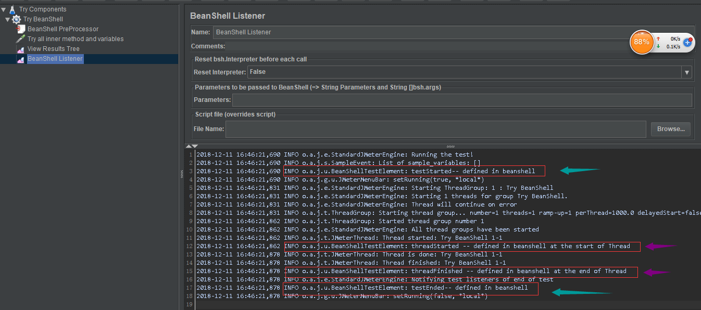

# BeanShell 概述

> BeanShellSampler 

用户可以使用BeanShell脚本语言自定义采样器. BeanShell 语法请参照 [BeanShell website](http://www.beanshell.org) .测试元素支持 **ThreadListener** 与 **TestListener** 的接口方法, 这些方法需要被预定义在初始化文件中. 定义举例：

BeanShellListener.bshrc (Click to expand)

	
	// Example BeanShell Listener definitions
	
	// ThreadListener methods

	threadStarted(){
		print("threadStarted");
	}

	threadFinished(){
		print("threadFinished");
	}

	// TestListener methods

	testStarted(){
		print("testStarted");
	}

	testEnded(){
		print("testEnded");
	}

	testStarted(String s){
		print("testStarted "+s);
	}

	testEnded(String s){
		print("testEnded "+s);
	}

	
官方文档对初始文件说明不够详细，通过查看配置文件jmeter.properties。对于ThreadListener和TestListener接口对应的初始化参数必须是beanshell.listener.init, 且在测试定义中启用BeanShellListener,该接口方法才会自动执行,注意是自动被执行,分别在测试起始和结束阶段,线程起始和结束阶段。

实际运行时序图:

因此,其BeanShell组件支持的方法需要在初始化文件定义的情况可以在配置文件中找到 beanshell.*.init 指定自己定义的脚本文件即可。

BeanShell 还支持 **Interrruptible** 接口, 方法 _interrupt()_ 可以被定义在脚本中或者初始文件中。

在采样器脚本中有些变量已经被初始化并赋值的，可直接在脚本中使用，具体定义如下：

